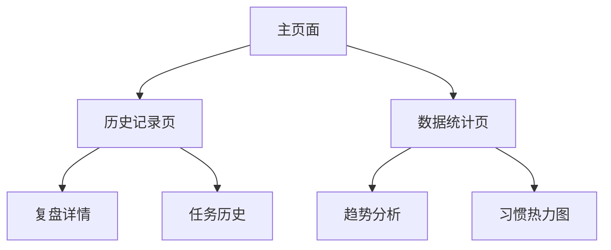

## 1. 产品概述

刑天是一个个人成长记录与复盘系统，帮助用户建立每日复盘习惯，记录成长轨迹，通过自我反思和任务管理改善生活节奏。目标用户是希望摆脱摆烂状态、建立自律习惯的职场人士。

项目箴言：你在构建一个迭代成长的系统。

阶段愿景：作为“回家后的仪式感启动器”和“元认知脚手架”，提供稳定的本地数据管理、复盘与计划联动；支持离线和隐私优先，并已集成可选的 Supabase 云同步。

产品价值：通过结构化复盘和任务管理，将抽象的成长目标转化为可执行的具体行动，形成正向反馈循环。

## 2. 核心功能

### 2.1 用户角色

| 角色   | 注册方式      | 核心权限             |
| ---- | --------- | ---------------- |
| 个人用户 | 本地使用，无需注册 | 完整使用所有功能，数据存储在本地 |

### 2.2 功能模块

刑天系统包含以下核心页面：

1. **主页面**：今日寄语、每日复盘、当下计划三大核心模块（已实现）
2. **设置与备份**：主页面工具栏提供导出/导入 JSON（已实现）
3. **云同步（可选）**：配置 `.env` 后自动与 Supabase 同步（已实现）

### 2.3 页面详情

| 页面名称  | 模块名称   | 功能描述 |
| ----- | ------ | ------ |
| 主页面   | 今日寄语   | 显示激励性语句，提供每日精神引导 |
| 主页面   | 每日复盘   | 填写今日产出、精力消耗、满意点；保存到本地与云端（可选） |
| 主页面   | 当下计划   | 快速添加任务，标记开始与完成；保存到本地与云端（可选） |
| 主页面   | 工具栏     | 数据导出/导入；显示云同步状态 |

## 3. 核心流程

### 日常使用流程

1. 用户打开应用，阅读今日寄语获得激励（随机/轮换）
2. 在每日复盘区域填写三个核心问题并保存（本地持久化）
3. 查看当下计划中的任务，选择开始或完成（状态同步）
4. 复盘与当下计划并排展示当日关键数据
5. 通过工具栏导出数据备份，必要时导入恢复
6. 若已配置 Supabase，自动云同步并显示状态

### 数据查看流程



## 4. 用户界面设计

### 4.1 设计风格

* **主色调**：深蓝色(#4a90e2)代表理性思考，绿色(#4CAF50)代表成长

* **按钮风格**：圆角矩形，hover效果增强交互感

* **字体**：系统默认字体，标题2.2rem，正文1rem

* **布局风格**：卡片式布局，清晰的功能分区

* **图标**：使用emoji图标，简洁直观

### 4.2 页面设计

| 页面名称  | 模块名称 | UI元素                         |
| ----- | ---- | ---------------------------- |
| 主页面   | 今日寄语 | 大字体标题居中，副标题斜体，底部边框分隔         |
| 主页面   | 每日复盘 | 三个问题区域垂直排列，文本框圆角边框，蓝色提交按钮    |
| 主页面   | 当下计划 | 任务卡片左边界标识，操作按钮并排显示，快速添加栏底部固定 |
| 历史记录页 | 复盘记录 | 时间轴形式展示，支持展开查看详情             |
| 数据统计页 | 图表区域 | 简洁的柱状图和折线图，热力图使用渐变色          |

### 4.3 响应式设计

桌面优先设计，适配移动端：

* 主容器最大宽度800px，居中显示

* 卡片在小屏幕下自动调整内边距

* 触摸友好的按钮大小（最小44px）

## 5. 数据模型

### 5.1 复盘记录(Review)

```typescript
interface Review {
  id: number          // 时间戳ID
  output: string      // 今日最有价值的产出
  drain: string       // 主要精力消耗
  satisfaction: string // 最满意的一点
  createdAt: string   // 创建日期(YYYY-MM-DD)
}
```

### 5.2 任务记录(Task)

```typescript
interface Task {
  id: number          // 时间戳ID
  title: string       // 任务标题
  completed: boolean  // 完成状态
  createdAt: string   // 创建时间
  completedAt?: string // 完成时间(可选)
}
```

## 6. 技术实现要点

### 6.1 本地存储策略

* 使用localStorage存储所有数据（键名：`xingtian-reviews`、`xingtian-tasks`）
* 在Pinia Store内封装读写，关键变更后立即持久化
* 提供数据导出/导入功能，支持备份与恢复
* 预留数据迁移能力（统一模型、版本号），为阶段2做准备

### 6.2 性能优化

* 使用Pinia进行状态管理（组合式API）
* 历史列表采用分页或虚拟滚动（后续）
* 在前端为常用查询建立派生/索引（如当日聚合）

### 6.3 用户体验

* 离线可用，无需网络连接
* 数据输入验证和错误提示
* 操作反馈和确认机制
* 键盘快捷与快捷添加任务

### 6.4 隐私与安全（阶段1）

* 数据默认仅存本地；用户可选择云同步
* 支持用户手动清理与导出
* 云同步使用 Supabase anon key；后续可升级为 Auth + RLS
### 5.3 联动视图（当日聚合）

```typescript
interface DaySnapshot {
  date: string // YYYY-MM-DD
  review?: Review
  tasks: Task[] // 当日创建或完成的任务
}
```

用于在主页面中快速聚合当天复盘与任务，形成当日叙事。
