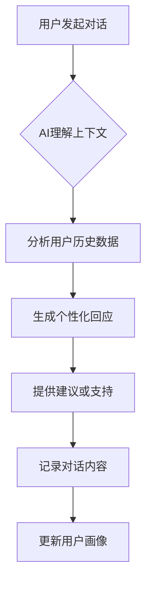
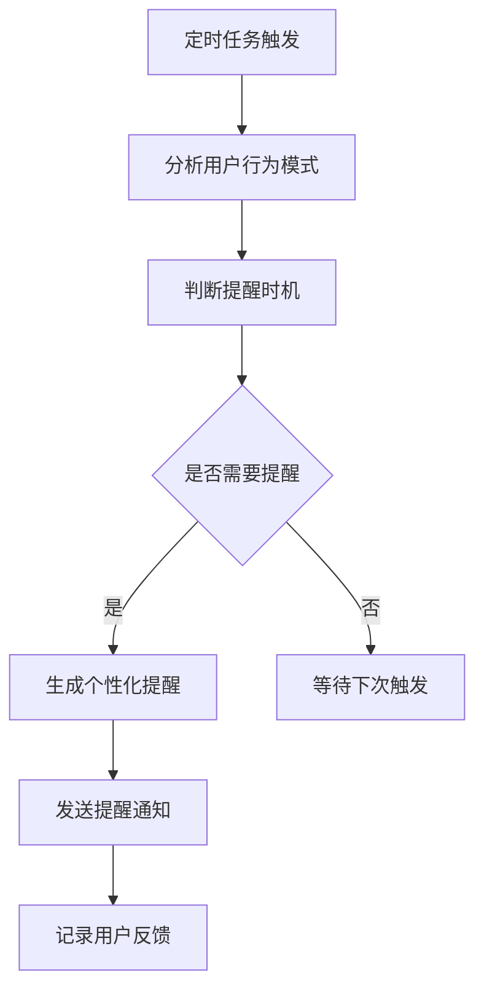
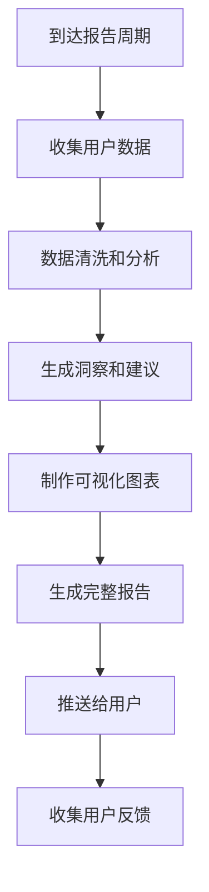

## 1. 产品概述
刑天AI教练版在原有复盘系统基础上，引入智能AI教练功能。通过分析用户的复盘数据和任务完成情况，提供个性化的成长建议、情绪支持和行动指导，真正成为用户的私人成长教练。

核心价值：从被动记录转向主动指导，AI教练基于用户历史数据提供洞察，帮助用户突破成长瓶颈，建立可持续的自我提升循环。

## 2. 核心功能升级

### 2.1 新增用户角色
| 角色 | 注册方式 | 核心权限 |
|------|----------|----------|
| 免费用户 | 邮箱注册 | 基础复盘和任务功能，有限的AI交互次数 |
| 高级用户 | 付费订阅 | 无限制AI教练对话，高级数据分析，个性化建议 |

### 2.2 新增功能模块
刑天AI教练版新增以下核心功能：
1. **AI教练对话**：基于上下文的智能对话，提供情绪支持和行动建议
2. **智能提醒**：根据用户习惯和行为模式，发送个性化提醒
3. **成长报告**：周度/月度成长报告，包含数据洞察和改进建议
4. **情绪分析**：分析复盘内容中的情绪变化，提供心理健康建议
5. **目标推荐**：基于用户历史表现，推荐合适的成长目标

### 2.3 详细功能设计
| 功能模块 | 子功能 | 功能描述 |
|----------|--------|----------|
| AI教练 | 对话界面 | 类ChatGPT的对话界面，支持连续对话和上下文理解 |
| AI教练 | 智能分析 | 分析用户复盘数据，识别模式和趋势 |
| AI教练 | 个性化建议 | 基于用户特点提供定制化的成长建议 |
| 智能提醒 | 复盘提醒 | 根据用户习惯在合适时间提醒复盘 |
| 智能提醒 | 任务提醒 | 基于任务优先级和截止时间智能提醒 |
| 智能提醒 | 情绪关怀 | 检测到负面情绪时主动关怀和建议 |
| 成长报告 | 周报生成 | 自动生成周度成长报告和改进建议 |
| 成长报告 | 月报生成 | 深度分析月度成长轨迹和目标达成情况 |
| 成长报告 | 年度总结 | 全年成长回顾和下年规划建议 |
| 情绪分析 | 情感识别 | 识别复盘文本中的情绪状态和变化 |
| 情绪分析 | 压力监测 | 监测用户的压力水平和变化趋势 |
| 情绪分析 | 心理健康 | 提供简单的心理健康评估和建议 |
| 目标推荐 | 智能目标 | 基于能力模型推荐合适的成长目标 |
| 目标推荐 | 路径规划 | 提供达成目标的详细路径和里程碑 |
| 目标推荐 | 进度跟踪 | 动态调整目标难度和期望值 |

## 3. 核心流程

### 3.1 AI教练交互流程


### 3.2 智能提醒流程


### 3.3 成长报告生成流程


## 4. 用户界面设计

### 4.1 新增界面设计
| 页面 | 模块 | UI元素 |
|------|------|--------|
| AI对话页 | 聊天界面 | 类似微信的聊天气泡，支持Markdown渲染 |
| AI对话页 | 快捷操作 | 预设常用问题，一键发起对话 |
| 报告页 | 数据可视化 | 图表库展示趋势，支持交互式探索 |
| 设置页 | AI配置 | 调节AI性格、提醒频率、隐私设置 |
| 个人中心 | 成长档案 | 可视化展示成长轨迹和能力模型 |

### 4.2 交互升级
- 语音输入支持，提升使用便利性
- 智能推荐相关问题和话题
- 情感化的UI反馈，根据情绪状态调整界面色调
- 手势操作支持，提升移动端体验

## 5. 数据模型扩展

### 5.1 用户模型(User)
```typescript
interface User {
  id: string
  email: string
  plan: 'free' | 'premium'
  aiPersonality: string    // AI性格配置
  reminderSettings: object // 提醒设置
  privacySettings: object  // 隐私设置
  createdAt: string
  updatedAt: string
}
```

### 5.2 AI对话模型(AIConversation)
```typescript
interface AIConversation {
  id: string
  userId: string
  messages: AIMessage[]
  context: object        // 对话上下文
  sentiment: number      // 情绪分数
  category: string       // 对话分类
  createdAt: string
}

interface AIMessage {
  role: 'user' | 'assistant'
  content: string
  timestamp: string
  metadata?: object
}
```

### 5.3 成长报告模型(GrowthReport)
```typescript
interface GrowthReport {
  id: string
  userId: string
  type: 'weekly' | 'monthly' | 'yearly'
  period: string
  data: {
    reviews: Review[]
    tasks: Task[]
    insights: Insight[]
    recommendations: Recommendation[]
  }
  sentiment: SentimentAnalysis
  generatedAt: string
}
```

### 5.4 用户画像模型(UserProfile)
```typescript
interface UserProfile {
  userId: string
  personalityTraits: object    // 性格特征
  behaviorPatterns: object     // 行为模式
  growthStage: string         // 成长阶段
  strengths: string[]         // 优势领域
  improvementAreas: string[]  // 改进领域
  preferences: object         // 偏好设置
  updatedAt: string
}
```

## 6. AI功能设计

### 6.1 智能分析能力
- **模式识别**：识别用户行为中的重复模式和趋势
- **情绪分析**：分析文本情感，识别情绪变化
- **能力评估**：基于任务完成情况评估用户能力
- **风险预警**：识别可能的倦怠、焦虑等风险信号

### 6.2 个性化建议
- **成长路径**：基于用户特点推荐合适的成长路径
- **技能建议**：推荐需要提升的技能和能力
- **习惯养成**：提供习惯养成的具体方法和时间表
- **情绪调节**：根据情绪状态提供调节建议

### 6.3 交互体验
- **自然对话**：支持多轮对话，理解上下文
- **多模态输入**：支持文本、语音等多种输入方式
- **智能推荐**：主动推荐相关话题和问题
- **情感陪伴**：提供情感支持和鼓励

## 7. 隐私与安全

### 7.1 数据保护
- 用户数据加密存储
- 支持数据导出和删除
- 透明的数据使用政策
- 最小化数据收集原则

### 7.2 AI伦理
- 避免偏见和歧视
- 提供AI决策的可解释性
- 用户控制AI建议的采纳程度
- 定期审查AI模型的公平性