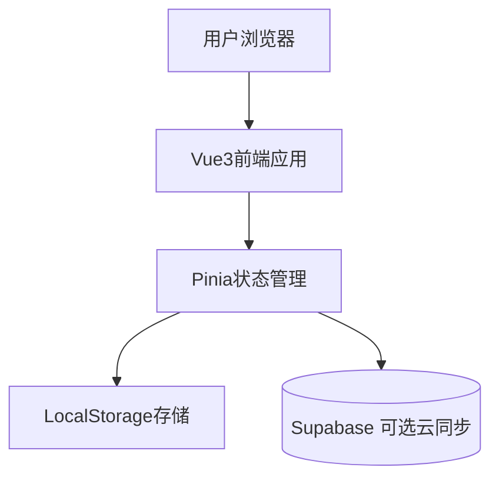

## 1. 架构设计



## 2. 技术栈描述

- **前端框架**: Vue 3 + TypeScript
- **状态管理**: Pinia
- **构建工具**: Vite
- **测试**: Vitest（已覆盖 stores 与 App 渲染）
- **CSS**: 原生 CSS
- **规范**: ESLint + Prettier

## 3. 路由定义

| 路由 | 用途 |
|------|------|
| / | 主页面，包含今日寄语、每日复盘、当下计划 |

## 4. 状态管理架构

### 4.1 ReviewStore - 复盘数据管理（已实现）
```typescript
// 核心方法
- addReview(reviewData): 添加新的复盘记录
- getReviewByDate(date): 按日期获取复盘记录
（范围查询与导出通过工具层实现）
```

### 4.2 TaskStore - 任务数据管理（已实现）
```typescript
// 核心方法
- addTask(title): 添加新任务
- updateTaskStatus(id, completed): 更新任务状态
- removeTask(id): 删除任务
- getCurrentTasks(): 获取当前未完成任务
（已完成任务可通过过滤获得）
```

（未实现，后续按需添加）

## 5. 组件架构

当前直接使用 `App.vue` 作为主页面，无历史与统计页面。

当前所有功能由 `App.vue` 集成实现，表单与列表直接在页面内呈现。

## 6. 工具函数

备份功能通过 `src/utils/backup.ts` 提供导出/导入 JSON（已实现）。

日期处理在 store 中直接使用 ISO 字符串，未抽象工具。

统计工具未实现。

## 7. 性能优化策略

### 7.1 数据管理
- 实现数据分页，避免一次性加载大量历史数据
- 使用计算属性缓存频繁访问的数据
- 实现数据的索引机制，提升查询效率

### 7.2 组件优化
- 使用Vue3的Suspense和异步组件
- 合理使用v-memo缓存静态内容
- 实现组件级别的错误边界

（未实现，后续按需优化）

## 8. 开发规范

### 8.1 代码规范
- 使用TypeScript严格模式
- 遵循Vue3 Composition API最佳实践
- 组件命名使用PascalCase
- 组合式函数使用use前缀

当前结构：`App.vue`、`stores/`、`services/`、`utils/`、`router/`（空）、`__tests__/`。

### 8.3 测试策略
- 单元测试：覆盖所有工具函数和store
- 集成测试：测试组件间的交互
- E2E测试：覆盖核心用户流程

## 9. 部署方案

### 9.1 构建配置
```typescript
// vite.config.ts
export default defineConfig({
  base: './',
  build: {
    target: 'es2015',
    outDir: 'dist',
    assetsDir: 'assets',
    sourcemap: true
  }
})
```

本地部署：`pnpm build` 后 `pnpm preview` 验证；云托管可按需选择。
