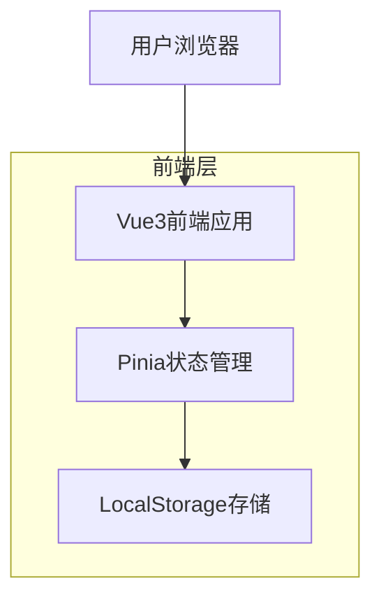

## 1. 架构设计



## 2. 技术栈描述

- **前端框架**: Vue3@3.4 + TypeScript@5
- **状态管理**: Pinia@2.1
- **构建工具**: Vite@5
- **测试框架**: Vitest@1.0 + Cypress@13
- **CSS框架**: 原生CSS + CSS变量
- **代码规范**: ESLint@8 + Prettier@3

## 3. 路由定义

| 路由 | 用途 |
|------|------|
| / | 主页面，包含今日寄语、每日复盘、当下计划 |
| /history | 历史记录页，查看复盘和任务历史 |
| /stats | 数据统计页，展示成长趋势和习惯分析 |

## 4. 状态管理架构

### 4.1 ReviewStore - 复盘数据管理
```typescript
// 核心方法
- addReview(reviewData): 添加新的复盘记录
- getReviewByDate(date): 按日期获取复盘记录
- getReviewsByDateRange(start, end): 获取日期范围内的记录
- exportReviews(): 导出所有复盘数据
```

### 4.2 TaskStore - 任务数据管理
```typescript
// 核心方法
- addTask(title): 添加新任务
- updateTaskStatus(id, completed): 更新任务状态
- removeTask(id): 删除任务
- getCurrentTasks(): 获取当前未完成任务
- getCompletedTasks(): 获取已完成任务
```

### 4.3 StatsStore - 数据统计
```typescript
// 核心方法
- getReviewFrequency(): 获取复盘频率统计
- getTaskCompletionRate(): 获取任务完成率
- getWeeklyProgress(): 获取周进度数据
- getMonthlyHabits(): 获取月度习惯数据
```

## 5. 组件架构

### 5.1 页面组件
```
src/
├── views/
│   ├── HomeView.vue          // 主页面
│   ├── HistoryView.vue       // 历史记录页
│   └── StatsView.vue         // 数据统计页
```

### 5.2 功能组件
```
├── components/
│   ├── review/
│   │   ├── ReviewForm.vue    // 复盘表单
│   │   ├── ReviewList.vue    // 复盘列表
│   │   └── ReviewCard.vue    // 复盘卡片
│   ├── task/
│   │   ├── TaskInput.vue     // 任务输入
│   │   ├── TaskCard.vue      // 任务卡片
│   │   └── TaskList.vue      // 任务列表
│   ├── stats/
│   │   ├── Chart.vue         // 图表组件
│   │   ├── Heatmap.vue       // 热力图
│   │   └── ProgressBar.vue   // 进度条
│   └── common/
│       ├── Motto.vue         // 今日寄语
│       └── Navigation.vue    // 导航组件
```

## 6. 工具函数

### 6.1 本地存储工具
```typescript
// utils/storage.ts
export const storage = {
  get<T>(key: string, defaultValue: T): T
  set(key: string, value: any): void
  remove(key: string): void
  clear(): void
  export(): string
  import(data: string): void
}
```

### 6.2 日期处理工具
```typescript
// utils/date.ts
export const dateUtil = {
  format(date: Date, format: string): string
  getToday(): string
  getWeekRange(): [string, string]
  getMonthRange(): [string, string]
  isSameDay(date1: string, date2: string): boolean
}
```

### 6.3 数据统计工具
```typescript
// utils/stats.ts
export const statsUtil = {
  calculateFrequency(data: any[], dateField: string): Record<string, number>
  calculateCompletionRate(completed: number, total: number): number
  generateHeatmapData(data: any[], dateField: string): number[][]
  calculateTrend(data: any[], valueField: string): number[]
}
```

## 7. 性能优化策略

### 7.1 数据管理
- 实现数据分页，避免一次性加载大量历史数据
- 使用计算属性缓存频繁访问的数据
- 实现数据的索引机制，提升查询效率

### 7.2 组件优化
- 使用Vue3的Suspense和异步组件
- 合理使用v-memo缓存静态内容
- 实现组件级别的错误边界

### 7.3 存储优化
- 实现数据压缩，减少localStorage占用
- 定期清理过期数据
- 提供数据归档功能

## 8. 开发规范

### 8.1 代码规范
- 使用TypeScript严格模式
- 遵循Vue3 Composition API最佳实践
- 组件命名使用PascalCase
- 组合式函数使用use前缀

### 8.2 文件组织
```
src/
├── assets/         // 静态资源
├── components/     // 可复用组件
├── composables/    // 组合式函数
├── router/         // 路由配置
├── stores/         // 状态管理
├── types/          // TypeScript类型定义
├── utils/          // 工具函数
├── views/          // 页面组件
└── __tests__/      // 测试文件
```

### 8.3 测试策略
- 单元测试：覆盖所有工具函数和store
- 集成测试：测试组件间的交互
- E2E测试：覆盖核心用户流程

## 9. 部署方案

### 9.1 构建配置
```typescript
// vite.config.ts
export default defineConfig({
  base: './',
  build: {
    target: 'es2015',
    outDir: 'dist',
    assetsDir: 'assets',
    sourcemap: true
  }
})
```

### 9.2 部署选项
- GitHub Pages：免费托管静态网站
- Netlify/Vercel：自动化部署和CDN
- 私有服务器：Nginx静态文件服务