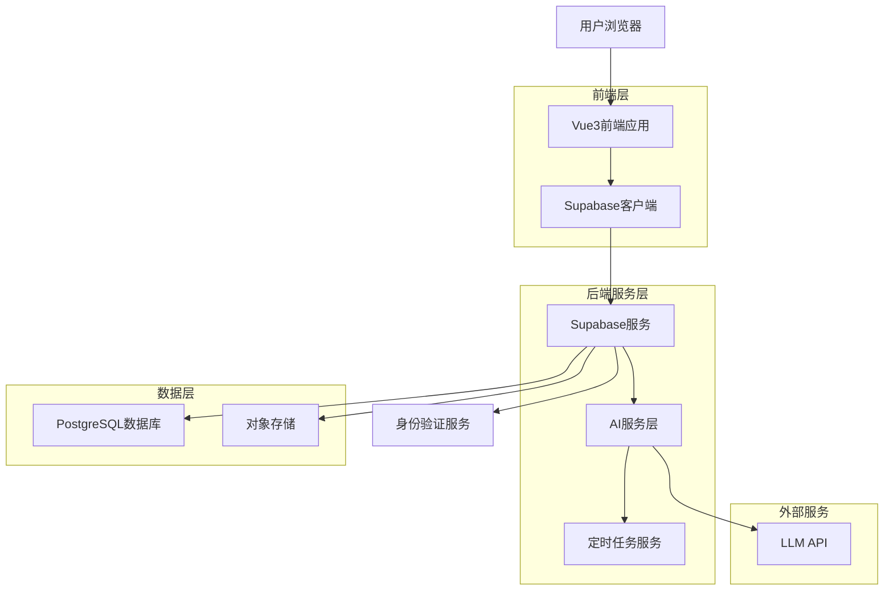
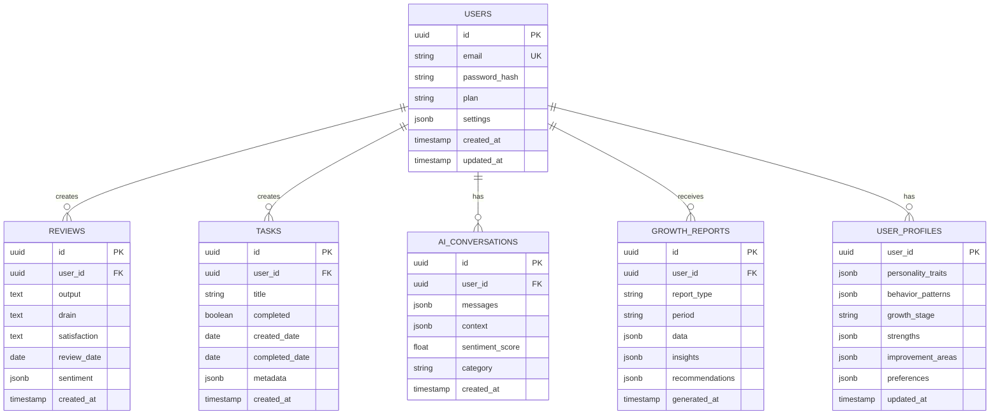
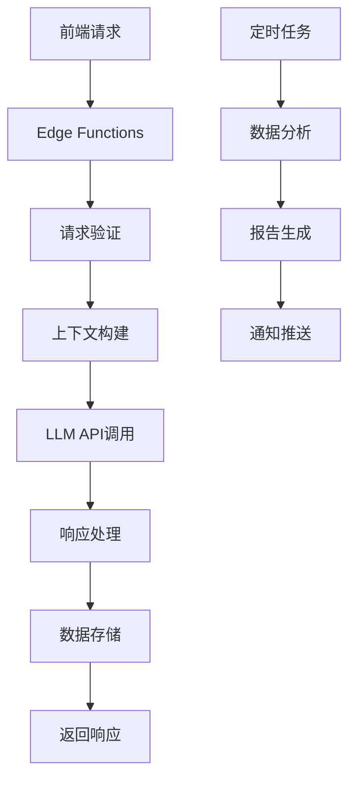

## 1. 架构设计



## 2. 技术栈描述

### 2.1 前端技术栈
- **前端框架**: Vue3@3.4 + TypeScript@5
- **状态管理**: Pinia@2.1
- **UI组件库**: Element Plus@2.4
- **图表库**: ECharts@5.4
- **构建工具**: Vite@5
- **HTTP客户端**: Axios@1.6

### 2.2 后端技术栈
- **后端服务**: Supabase (BaaS)
- **数据库**: PostgreSQL@15
- **身份认证**: Supabase Auth
- **文件存储**: Supabase Storage
- **实时功能**: Supabase Realtime
- **边缘函数**: Supabase Edge Functions

### 2.3 AI服务
- **LLM服务**: OpenAI GPT-4 API / Claude API
- **向量数据库**: pgvector (PostgreSQL扩展)
- **文本分析**: 自建分析服务
- **定时任务**: Supabase Edge Functions + Cron

## 3. 路由定义

### 3.1 前端路由
| 路由 | 用途 | 权限要求 |
|------|------|----------|
| / | 主页面，核心功能 | 无需登录 |
| /login | 登录页面 | 无需登录 |
| /register | 注册页面 | 无需登录 |
| /dashboard | 个人仪表板 | 需要登录 |
| /history | 历史记录 | 需要登录 |
| /stats | 数据统计 | 需要登录 |
| /ai-coach | AI教练对话 | 需要登录 |
| /reports | 成长报告 | 需要登录 |
| /settings | 个人设置 | 需要登录 |
| /profile | 个人档案 | 需要登录 |

### 3.2 API路由
| 路由 | 方法 | 用途 |
|------|------|------|
| /api/auth/login | POST | 用户登录 |
| /api/auth/register | POST | 用户注册 |
| /api/auth/logout | POST | 用户登出 |
| /api/reviews | GET/POST | 复盘记录管理 |
| /api/tasks | GET/POST/PUT/DELETE | 任务管理 |
| /api/ai/conversation | POST | AI对话 |
| /api/ai/analyze | POST | AI分析 |
| /api/reports | GET | 成长报告 |
| /api/user/profile | GET/PUT | 用户档案 |
| /api/user/settings | GET/PUT | 用户设置 |

## 4. 数据库设计

### 4.1 数据模型关系图


### 4.2 数据库表结构

#### 用户表(users)
```sql
CREATE TABLE users (
  id UUID PRIMARY KEY DEFAULT gen_random_uuid(),
  email VARCHAR(255) UNIQUE NOT NULL,
  password_hash VARCHAR(255) NOT NULL,
  plan VARCHAR(20) DEFAULT 'free' CHECK (plan IN ('free', 'premium')),
  settings JSONB DEFAULT '{}',
  created_at TIMESTAMP WITH TIME ZONE DEFAULT NOW(),
  updated_at TIMESTAMP WITH TIME ZONE DEFAULT NOW()
);

-- 索引
CREATE INDEX idx_users_email ON users(email);
CREATE INDEX idx_users_plan ON users(plan);
```

#### 复盘记录表(reviews)
```sql
CREATE TABLE reviews (
  id UUID PRIMARY KEY DEFAULT gen_random_uuid(),
  user_id UUID REFERENCES users(id) ON DELETE CASCADE,
  output TEXT NOT NULL,
  drain TEXT NOT NULL,
  satisfaction TEXT NOT NULL,
  review_date DATE NOT NULL,
  sentiment JSONB DEFAULT '{}',
  created_at TIMESTAMP WITH TIME ZONE DEFAULT NOW()
);

-- 索引
CREATE INDEX idx_reviews_user_id ON reviews(user_id);
CREATE INDEX idx_reviews_review_date ON reviews(review_date);
CREATE INDEX idx_reviews_user_date ON reviews(user_id, review_date);
```

#### 任务表(tasks)
```sql
CREATE TABLE tasks (
  id UUID PRIMARY KEY DEFAULT gen_random_uuid(),
  user_id UUID REFERENCES users(id) ON DELETE CASCADE,
  title VARCHAR(255) NOT NULL,
  completed BOOLEAN DEFAULT FALSE,
  created_date DATE NOT NULL,
  completed_date DATE,
  metadata JSONB DEFAULT '{}',
  created_at TIMESTAMP WITH TIME ZONE DEFAULT NOW()
);

-- 索引
CREATE INDEX idx_tasks_user_id ON tasks(user_id);
CREATE INDEX idx_tasks_completed ON tasks(completed);
CREATE INDEX idx_tasks_created_date ON tasks(created_date);
```

#### AI对话表(ai_conversations)
```sql
CREATE TABLE ai_conversations (
  id UUID PRIMARY KEY DEFAULT gen_random_uuid(),
  user_id UUID REFERENCES users(id) ON DELETE CASCADE,
  messages JSONB NOT NULL,
  context JSONB DEFAULT '{}',
  sentiment_score FLOAT,
  category VARCHAR(50),
  created_at TIMESTAMP WITH TIME ZONE DEFAULT NOW()
);

-- 索引
CREATE INDEX idx_ai_conv_user_id ON ai_conversations(user_id);
CREATE INDEX idx_ai_conv_category ON ai_conversations(category);
CREATE INDEX idx_ai_conv_created_at ON ai_conversations(created_at DESC);
```

## 5. AI服务架构

### 5.1 AI服务架构图


### 5.2 AI服务核心功能

#### 对话管理服务
```typescript
// 核心方法
- createConversation(userId, initialMessage)
- addMessage(conversationId, message, role)
- getConversationHistory(conversationId)
- analyzeSentiment(messages)
- categorizeConversation(messages)
```

#### 智能分析服务
```typescript
// 核心方法
- analyzeUserBehavior(userId, timeRange)
- generateInsights(userId, data)
- createRecommendations(userProfile, behavior)
- predictGrowthTrend(userHistory)
- identifyRiskFactors(userData)
```

#### 报告生成服务
```typescript
// 核心方法
- generateWeeklyReport(userId)
- generateMonthlyReport(userId)
- createVisualizations(data)
- generateRecommendations(analysis)
- formatReportContent(data, insights)
```

## 6. 定时任务设计

### 6.1 定时任务列表
| 任务名称 | 执行频率 | 功能描述 |
|----------|----------|----------|
| 智能提醒检查 | 每4小时 | 检查用户行为，发送个性化提醒 |
| 数据备份 | 每日凌晨2点 | 备份用户数据到对象存储 |
| 报告生成 | 每周一/每月1号 | 生成周/月成长报告 |
| 用户画像更新 | 每日 | 更新用户行为画像 |
| 数据清理 | 每周 | 清理过期和冗余数据 |
| AI模型训练 | 每月 | 基于新数据优化AI模型 |

### 6.2 定时任务实现
```typescript
// Supabase Edge Functions - cron.ts
export async function handler(request: Request) {
  const cronJobs = {
    '0 */4 * * *': sendSmartReminders,
    '0 2 * * *': backupUserData,
    '0 0 * * 1': generateWeeklyReports,
    '0 0 1 * *': generateMonthlyReports,
    '0 1 * * *': updateUserProfiles,
    '0 3 * * 0': cleanupOldData,
    '0 4 1 * *': trainAIModels
  }
  
  // 执行对应时间点的任务
  // ...
}
```

## 7. 安全与隐私

### 7.1 数据安全
- 用户密码使用bcrypt加密存储
- 敏感数据传输使用HTTPS
- 实现数据访问权限控制
- 定期安全审计和漏洞扫描

### 7.2 隐私保护
- 用户数据最小化收集原则
- 提供数据导出和删除功能
- 透明的数据使用政策
- 用户控制AI数据使用权限

### 7.3 AI伦理
- 避免AI偏见和歧视
- 提供AI决策的可解释性
- 用户可选择退出AI分析
- 定期审查AI模型的公平性

## 8. 性能优化

### 8.1 数据库优化
- 合理使用索引提升查询性能
- 实现数据分页避免全表扫描
- 使用物化视图加速复杂查询
- 定期分析和优化查询计划

### 8.2 缓存策略
- 使用Redis缓存热点数据
- 实现API响应缓存
- 使用CDN加速静态资源
- 实现客户端数据缓存

### 8.3 AI服务优化
- 实现AI请求队列管理
- 使用向量数据库存储用户画像
- 实现AI响应缓存机制
- 优化LLM提示词减少token消耗